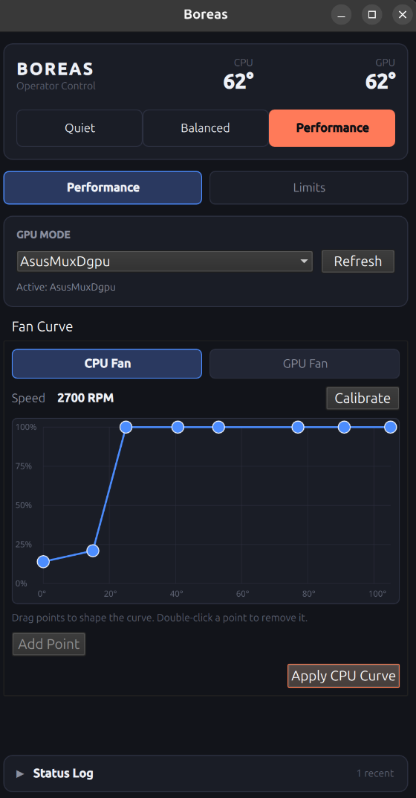
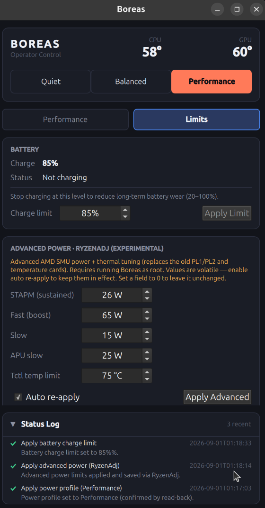

# Boreas

Boreas is a small Linux desktop control panel for ASUS ROG laptops with AMD
hardware. It brings power profiles, fan curves, GPU mode, battery charge
limits, temperature monitoring, and optional RyzenAdj controls into one Qt/QML
application.

This is still a work in progress. The UI is usable, but hardware support
depends on the laptop, kernel, and services installed on the system.

## Screenshots

### Performance and fan curve



### Battery and advanced power limits



## What is working

- Quiet, Balanced, and Performance power profiles
- CPU and GPU temperature readouts
- CPU and GPU fan curve editing when the driver supports it
- GPU mode selection through `supergfxctl`
- Battery charge limit configuration
- Optional RyzenAdj power and temperature controls
- Per-profile settings persistence
- A small status log with read-back results for writes
- Runtime capability detection with disabled controls and useful failure text

The controls are deliberately optional. Boreas checks what the machine exposes
at runtime rather than assuming every ASUS model has the same interfaces.

## Requirements

- Linux
- CMake 3.21 or newer
- A C++17 compiler
- Qt 6.5 or newer with Core, Gui, Quick, Qml, DBus, and Test
- `supergfxctl` for GPU mode support, if available on the system
- `asusd` for fan curves on systems that use its D-Bus interface
- `ryzenadj` for the experimental advanced power controls

The test build fetches [RapidCheck](https://github.com/emil-e/rapidcheck)
through CMake's `FetchContent`.

## Build

From the repository root:

```sh
cmake -S . -B build
cmake --build build -j$(nproc)
```

Run the application with:

```sh
./build/Boreas
```

## Tests

The tests use in-memory fakes for the hardware interfaces, so the unit and
property tests do not need ASUS hardware or root access:

```sh
ctest --test-dir build --output-on-failure
```

The D-Bus integration test uses a private session bus and does not modify the
system services. Hardware behavior still needs to be checked on a supported
laptop.

## Hardware notes

Boreas talks to a mix of Linux sysfs attributes and D-Bus services. The exact
dependencies and fallback behavior are documented in
[`docs/hardware-dependency-map.md`](docs/hardware-dependency-map.md).

Some power-limit writes can block or fail on particular kernels. Boreas puts a
timeout around those writes and reads the values back instead of treating the
requested values as proof that the hardware accepted them.

GPU mode switching may require logging out or rebooting before the change is
fully applied. `supergfxctl` is also being phased out, so GPU mode support may
be unavailable even when the rest of the application works.

## Project layout

```text
.
├── qml/       Application UI
├── tests/     Unit, property, and integration tests
├── docs/      Hardware notes and screenshots
├── RyzenAdj/  Optional RyzenAdj source tree
└── ryzen_smu/ Optional kernel-driver source tree
```

The `RyzenAdj` and `ryzen_smu` directories are supporting source trees; Boreas
does not build the kernel module as part of its normal CMake build.

## License

No project license has been chosen yet.